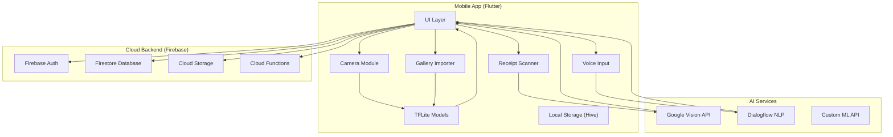
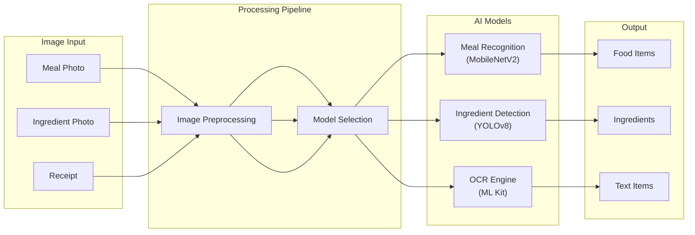
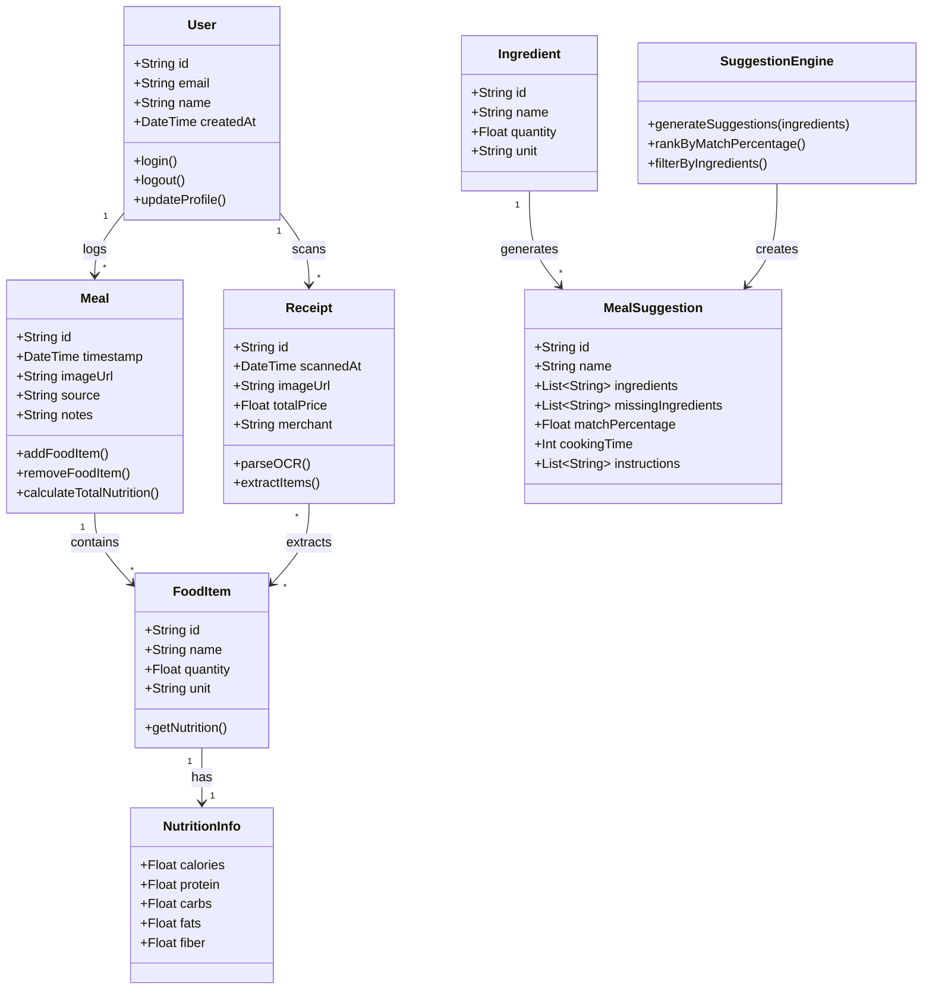
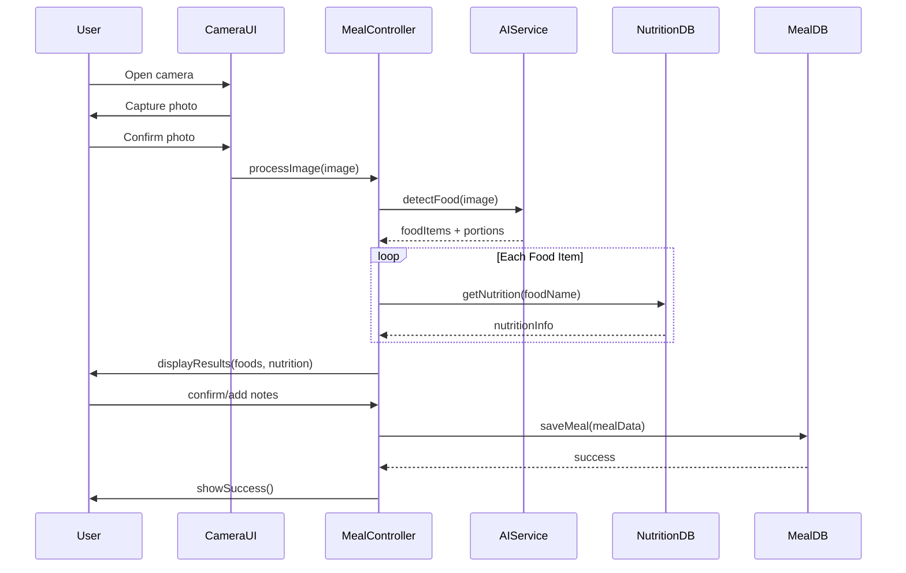
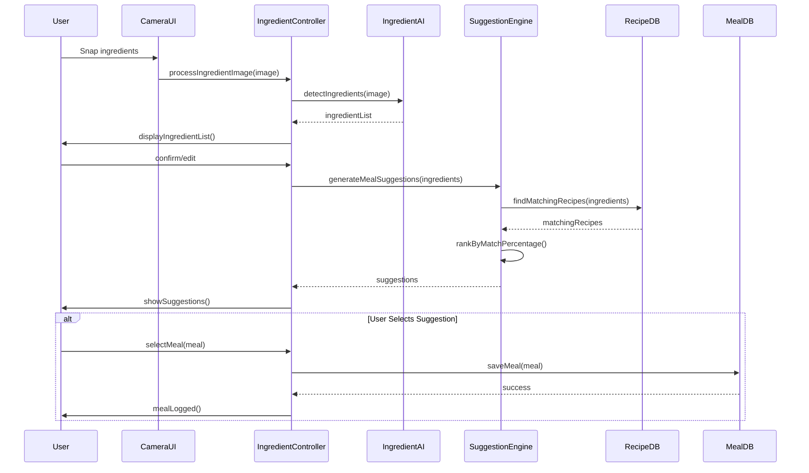
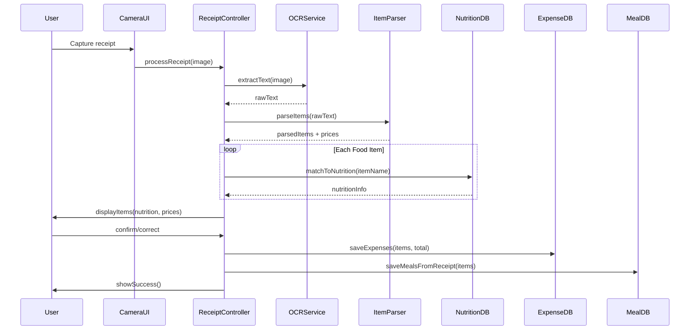
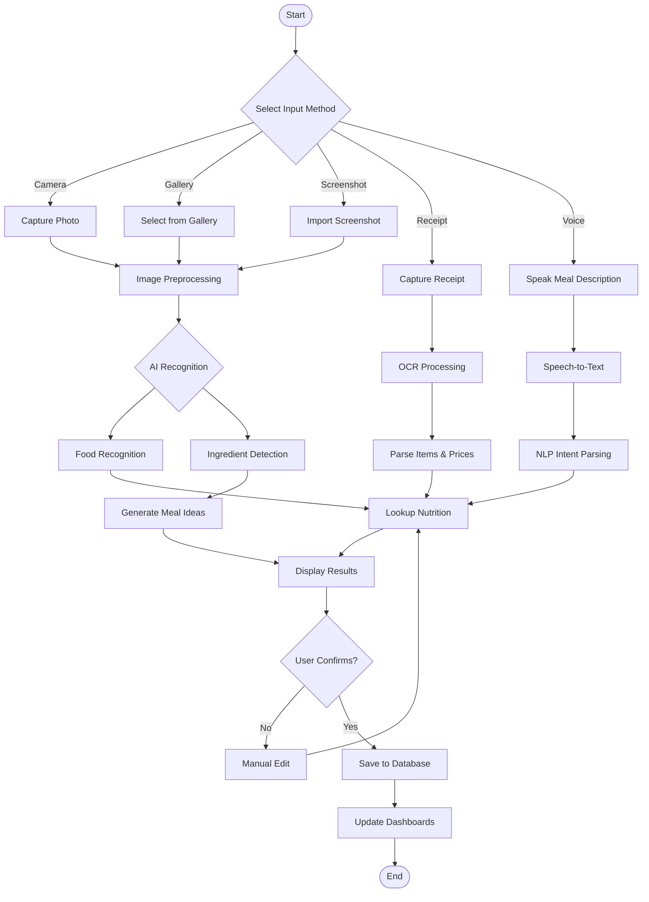
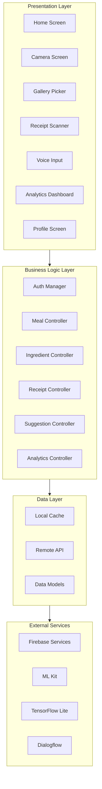

# **MealSnap+ — Complete Academic Documentation**

### *An AI-Powered Multimodal Food Recognition, Nutrition Tracking, and Intelligent Meal Suggestion System*

---

**Prepared by:** Narmaye Patrick
**Course:** Android application development
**Date:** March 2026
**Version:** 4.0

---

## 📑 **Table of Contents**

1. Introduction
2. Problem Statement & Motivation
3. Literature Review
4. Objectives & Scope
5. Target Users & Personas
6. Functional & Non-Functional Requirements
7. Key Features
8. System Architecture
9. UML Diagrams
10. Database Design
11. Implementation Plan
12. Release Roadmap
13. Testing Strategy
14. Evaluation Metrics
15. Risk Assessment
16. Future Enhancements
17. Conclusion
18. References

---

## 1. Introduction

In an era where health consciousness and financial prudence are paramount, individuals struggle to maintain consistent food tracking habits. Traditional nutrition apps require tedious manual input, often leading to user abandonment. Simultaneously, many people find themselves staring at their refrigerators, unsure of what meals they can prepare with available ingredients.

**MealSnap+** is a revolutionary mobile application that addresses these challenges by leveraging artificial intelligence, computer vision, and optical character recognition to create a seamless food logging and meal planning experience. The app allows users to:

- 📸 **Photograph meals** for automatic nutrition analysis
- 🖼️ **Import screenshots or gallery images** for retrospective logging
- 🧾 **Scan receipts** to track food expenses and extract meal data
- 🥬 **Snap ingredient photos** to receive intelligent meal suggestions
- 🗣️ **Use voice commands** for hands-free logging
- 📍 **Leverage sensor data** (location, time) for contextual assistance

Unlike existing solutions, MealSnap+ is specifically tailored to African culinary contexts, recognising local dishes like ndolé, eru, fufu, and plantain, while adapting price estimations to regional economies.

---

## 2. Problem Statement & Motivation

### 2.1 Core Problems

| Problem | Description | Impact |
|---------|-------------|--------|
| **Manual Input Burden** | Users must search databases, enter quantities, and calculate macros manually | High abandonment rates (80% within 30 days) |
| **Cultural Blindness** | Existing apps lack African dish databases | Poor accuracy for local users |
| **No Recipe Inspiration** | Users waste food and time wondering what to cook | Increased food waste, meal monotony |
| **Disconnected Tracking** | Nutrition tracking separate from expense tracking | Incomplete understanding of food habits |
| **Input Friction** | Multiple steps required to log one meal | Low user retention |

### 2.2 Motivation

MealSnap+ was conceived to solve these problems through:

- **AI automation** — reducing user effort to a single photo
- **Multimodal input** — accommodating various user scenarios
- **Localisation** — serving African users with relevant data
- **Convergence** — merging nutrition, expense, and meal planning into one app

---

## 3. Literature Review

### 3.1 Food Recognition Technologies

Early food recognition systems relied on handcrafted features and traditional classifiers. The advent of deep learning, particularly convolutional neural networks (CNNs), revolutionised the field. **Bossard et al. (2014)** introduced Food-101, a dataset of 101,000 images across 101 food categories, achieving 50.76% accuracy with random forests. Modern architectures like **ResNet-50** and **EfficientNet** exceed 85% accuracy on standard benchmarks.

**Key Challenge:** Most models are trained on Western cuisine, limiting their utility in African contexts. **Meyers et al. (2015)** demonstrated the feasibility of portion estimation through reference objects, a technique adopted in MealSnap+.

### 3.2 Optical Character Recognition for Receipts

Receipt parsing has evolved from rule-based systems to deep learning approaches. **Google Vision API** and **Tesseract** provide robust OCR capabilities, with accuracy exceeding 95% for printed text. However, handwritten receipts remain challenging. **Chen et al. (2018)** proposed hybrid approaches combining OCR with natural language processing to improve item extraction.

### 3.3 Ingredient-to-Recipe Systems

**Food recommendation systems** have traditionally relied on user ratings. Recent advances in **graph-based recommendation** and **knowledge graphs** enable systems to suggest recipes based on available ingredients. **Tran et al. (2019)** developed Recipe1M+, a large-scale dataset of 1 million recipes with ingredient mapping, demonstrating the feasibility of ingredient-driven recipe suggestion.

### 3.4 African Cuisine Nutritional Data

The **FAO African Food Composition Tables** provide baseline nutritional data for common African ingredients. However, cooked dishes remain poorly documented. This gap presents an opportunity for MealSnap+ to contribute user-verified data.

---

## 4. Objectives & Scope

### 4.1 Primary Objectives

| Objective | Description |
|-----------|-------------|
| **O1** | Develop a mobile application supporting five input modalities (camera, gallery, receipt, voice, ingredient snapshot) |
| **O2** | Implement AI models for food and ingredient recognition with ≥75% top-3 accuracy |
| **O3** | Create a meal suggestion engine that generates recipes from detected ingredients |
| **O4** | Build an extensible nutritional database covering African dishes |
| **O5** | Integrate expense tracking through receipt scanning |
| **O6** | Conduct user testing with 20+ participants and collect structured feedback |

### 4.2 Scope

**In Scope:**
- Android and iOS mobile application (Flutter)
- Camera, gallery, and screenshot import
- Food and ingredient recognition
- Meal suggestion engine
- Receipt OCR and parsing
- Nutrition tracking dashboard
- Expense tracking and analytics
- User feedback collection

**Out of Scope:**
- Wearable integration (future work)
- Social features (future work)
- E-commerce integration
- Advanced meal planning with dietary restrictions

---

## 5. Target Users & Personas

### 5.1 Primary Personas

| Persona | Age | Occupation | Pain Points | Needs |
|---------|-----|------------|-------------|-------|
| **Sarah** | 22 | University Student | Limited budget, irregular eating, no time for manual tracking | Quick food logging, budget tracking, meal ideas from leftovers |
| **Jean** | 35 | IT Professional | Health-conscious, wants to lose weight, busy schedule | Automated nutrition tracking, restaurant receipt logging |
| **Mama Grace** | 45 | Homemaker | Manages family meals, wants to reduce food waste | Ingredient-based meal ideas, family nutrition overview |
| **David** | 28 | Fitness Trainer | Tracking macros, clients ask for meal advice | Precise nutrition data, client report export |

### 5.2 Secondary Users

- **Nutritionists** — for client meal tracking
- **Students** — for academic research on eating habits
- **Restaurant owners** — for digitising receipts

---

## 6. Functional & Non-Functional Requirements

### 6.1 Functional Requirements

| ID | Requirement | Priority |
|----|-------------|----------|
| FR01 | User registration/login via email or Google | High |
| FR02 | Capture meal photo and detect food items | High |
| FR03 | Import images from gallery or screenshots | High |
| FR04 | Detect ingredients from photos | High |
| FR05 | Generate meal suggestions from detected ingredients | High |
| FR06 | Scan receipts and extract food items/prices | Medium |
| FR07 | Voice input for meal logging | Medium |
| FR08 | View nutrition dashboard (calories, macros) | High |
| FR09 | View expense dashboard (daily/weekly/monthly) | Medium |
| FR10 | Export data as PDF | Low |
| FR11 | Provide feedback on recognition accuracy | Medium |
| FR12 | Manual edit of detected items | High |

### 6.2 Non-Functional Requirements

| ID | Requirement | Target |
|----|-------------|--------|
| NFR01 | **Performance** | Meal recognition ≤ 3 seconds |
| NFR02 | **Usability** | ≤3 taps to log a meal |
| NFR03 | **Accuracy** | ≥75% top-3 food recognition |
| NFR04 | **Offline Support** | Basic recognition without internet |
| NFR05 | **Security** | End-to-end encryption for user data |
| NFR06 | **Scalability** | Support 10,000+ concurrent users |

---

## 7. Key Features

### 7.1 Core Features

#### 📸 **Meal Scan**
- AI identifies dishes from photos
- Estimates calories, macros, and portion size
- Suggests healthier alternatives

#### 🖼️ **Screenshot & Gallery Import**
- Import any food image from device
- Process retroactively logged meals

#### 🧾 **Receipt Scan**
- OCR extracts items and prices
- Categorises purchases (groceries, restaurants)
- Builds expense history

#### 🥬 **Ingredient Snapshot**
- Detects individual ingredients from fridge/pantry photos
- Shows ingredient list with quantities

#### 🍳 **Meal Suggestion Engine**
- Generates recipes from detected ingredients
- Ranks suggestions by ingredient match percentage
- Provides cooking time estimates

#### 🗣️ **Voice Input**
- "Add rice and beans for lunch"
- Automatic parsing and logging

#### 📍 **Sensor-Assisted Context**
- Time-based meal suggestions (breakfast, lunch, dinner)
- Location-based price estimation

#### 📊 **Unified Dashboard**
- Calorie tracking
- Expense tracking
- Meal history with images
- Weekly/monthly trends

---

## 8. System Architecture

### 8.1 High-Level Architecture



### 8.2 Technology Stack

| Layer | Technology | Rationale |
|-------|------------|----------|
| **Frontend** | Flutter (Dart) | Cross-platform, fast development, rich UI |
| **Backend** | Firebase | Integrated auth, database, storage, serverless |
| **Food Recognition** | TensorFlow Lite | On-device, low latency, privacy-preserving |
| **OCR** | Google ML Kit | On-device receipt scanning |
| **Voice NLP** | Dialogflow | Intent parsing with minimal training |
| **Database** | Firestore + Hive | Cloud sync with offline caching |
| **Analytics** | Firebase Analytics + Custom | Usage tracking and user insights |

### 8.3 AI Model Architecture



---

## 9. UML Diagrams

### 9.1 Use Case Diagram

```mermaid
flowchart TD
    User((User))
    Admin((Admin))

    subgraph MainFeatures["Core User Features"]
        UC1[Take Meal Photo]
        UC2[Import Screenshot/Gallery]
        UC3[Snap Ingredients]
        UC4[Scan Receipt]
        UC5[Voice Meal Logging]
        UC6[View Meal History]
        UC7[View Nutrition Dashboard]
        UC8[View Expense Dashboard]
        UC9[Export Reports]
        UC10[Provide Feedback]
    end

    subgraph AIFeatures["AI-Powered Features"]
        UC11[Food Recognition]
        UC12[Ingredient Detection]
        UC13[Meal Suggestion Engine]
        UC14[Receipt OCR & Parsing]
    end

    subgraph AdminFeatures["Admin Features"]
        UC15[Manage Food Database]
        UC16[Review User Feedback]
        UC17[Monitor System Health]
    end

    User --> UC1
    User --> UC2
    User --> UC3
    User --> UC4
    User --> UC5
    User --> UC6
    User --> UC7
    User --> UC8
    User --> UC9
    User --> UC10
    User --> UC11
    User --> UC12
    User --> UC13
    User --> UC14

    Admin --> UC15
    Admin --> UC16
    Admin --> UC17
```



### 9.2 Class Diagram



### 9.3 Sequence Diagram — Meal Photo Logging



### 9.4 Sequence Diagram — Ingredient-to-Meal Suggestion



### 9.5 Sequence Diagram — Receipt Scan



### 9.6 Activity Diagram — Complete Meal Logging Flow



### 9.7 Component Diagram



---

## 10. Database Design

### 10.1 Entity-Relationship Diagram (ERD)

```mermaid
erDiagram
    USERS ||--o{ MEALS : logs
    USERS ||--o{ RECEIPTS : scans
    USERS ||--o{ FEEDBACK : submits

    MEALS ||--o{ MEAL_ITEMS : contains
    MEAL_ITEMS ||--|| NUTRITION : has

    RECEIPTS ||--o{ RECEIPT_ITEMS : contains
    RECEIPT_ITEMS }o--|| FOOD_ITEMS : maps_to

    INGREDIENTS ||--o{ MEAL_SUGGESTIONS : generates
    MEAL_SUGGESTIONS }o--|| MEALS : suggests

    USERS {
        string user_id PK
        string email UK
        string name
        string photo_url
        datetime created_at
        datetime last_login
    }

    MEALS {
        string meal_id PK
        string user_id FK
        string image_url
        string source ENUM
        datetime timestamp
        string notes
        float total_calories
    }

    MEAL_ITEMS {
        string item_id PK
        string meal_id FK
        string food_name
        float quantity
        string unit
        float calories
        float protein
        float carbs
        float fats
    }

    NUTRITION {
        string nutrition_id PK
        string food_name UK
        float calories_per_100g
        float protein_per_100g
        float carbs_per_100g
        float fats_per_100g
        float fiber_per_100g
    }

    RECEIPTS {
        string receipt_id PK
        string user_id FK
        string image_url
        string ocr_text
        float total_amount
        string merchant
        datetime scanned_at
    }

    RECEIPT_ITEMS {
        string item_id PK
        string receipt_id FK
        string description
        float price
        string category
    }

    FOOD_ITEMS {
        string food_id PK
        string name
        string category
        boolean is_african
    }

    INGREDIENTS {
        string ingredient_id PK
        string name
        string category
        float typical_price
    }

    MEAL_SUGGESTIONS {
        string suggestion_id PK
        string meal_name
        string instructions
        int cooking_time
        string difficulty
        string image_url
    }

    FEEDBACK {
        string feedback_id PK
        string user_id FK
        string type
        string message
        datetime submitted_at
        boolean resolved
    }
```

### 10.2 Firestore Collection Structure

```javascript
// Users Collection
users/{userId} {
    email: string,
    name: string,
    photoURL: string,
    createdAt: timestamp,
    preferences: {
        dietaryRestrictions: array,
        budgetLimit: number,
        defaultCurrency: string
    }
}

// Meals Collection
meals/{mealId} {
    userId: string,
    imageURL: string,
    source: "camera" | "gallery" | "receipt" | "voice",
    timestamp: timestamp,
    location: geoPoint,
    items: [{
        foodName: string,
        quantity: number,
        unit: string,
        nutrition: {
            calories: number,
            protein: number,
            carbs: number,
            fats: number
        }
    }],
    totalCalories: number,
    notes: string,
    verified: boolean
}

// Receipts Collection
receipts/{receiptId} {
    userId: string,
    imageURL: string,
    ocrText: string,
    items: [{
        description: string,
        price: number,
        category: string,
        matchedFood: string (optional)
    }],
    totalAmount: number,
    merchant: string,
    scannedAt: timestamp
}

// Nutrition Database
nutrition/{foodName} {
    name: string,
    caloriesPer100g: number,
    proteinPer100g: number,
    carbsPer100g: number,
    fatsPer100g: number,
    fiberPer100g: number,
    servingSize: string,
    isAfrican: boolean,
    alternativeNames: array
}

// Meal Suggestions
suggestions/{suggestionId} {
    mealName: string,
    ingredients: [{
        name: string,
        quantity: string,
        optional: boolean
    }],
    instructions: array,
    cookingTime: number,
    difficulty: "easy" | "medium" | "hard",
    nutrition: object,
    imageURL: string,
    tags: array
}
```

---

## 11. Implementation Plan

### 11.1 Development Phases

| Phase | Duration | Focus | Deliverables |
|-------|----------|-------|--------------|
| **Phase 1: Setup** | 1 week | Project initialization | Git repo, Firebase setup, Flutter project structure |
| **Phase 2: Core UI** | 2 weeks | Screens and navigation | Home, camera, gallery, profile screens |
| **Phase 3: AI Integration** | 3 weeks | Model integration | TFLite model, ML Kit, API connections |
| **Phase 4: Backend** | 2 weeks | Firebase services | Auth, Firestore, Storage, Cloud Functions |
| **Phase 5: Testing** | 2 weeks | QA and user testing | Unit tests, integration tests, user feedback |
| **Phase 6: Polish** | 2 weeks | Refinement | UI polish, performance optimization, documentation |

### 11.2 Key Implementation Tasks

| Task | Technology | Priority | Estimated Hours |
|------|------------|----------|-----------------|
| Camera integration | camera package | High | 8 |
| Gallery import | image_picker | High | 4 |
| Voice input | speech_to_text | Medium | 6 |
| TFLite model integration | tflite_flutter | High | 16 |
| Firebase Auth | firebase_auth | High | 4 |
| Firestore integration | cloud_firestore | High | 8 |
| Cloud Functions | Node.js | Medium | 12 |
| Receipt OCR | google_ml_kit | Medium | 10 |
| Dialogflow integration | dialogflow | Medium | 8 |
| Analytics dashboard | fl_chart | Medium | 12 |
| Testing | flutter_test | High | 16 |

---

## 12. Release Roadmap

### 🟦 **Release 1 — MVP (Week 1-4)**

**Goal:** Establish core functionality and gather initial user feedback.

**Features:**
- User registration/login
- Camera meal capture
- Basic food recognition (20 dishes)
- Manual meal entry
- Simple meal history
- Calories display
- Google login

**Success Metrics:**
- 10+ test users
- 70% successful recognition rate
- Average logging time < 30 seconds

---

### 🟩 **Release 2 — Ingredient & Suggestion Edition (Week 5-10)**

**Goal:** Unlock intelligent meal suggestions from ingredient photos.

**Features:**
- Ingredient detection from photos
- Ingredient-to-meal suggestion engine
- Screenshot & gallery import upgrade
- Expanded food database (100+ items)
- African dish recognition (ndolé, eru, fufu, etc.)
- Nutrition macros (protein, carbs, fats)
- Weekly insights dashboard

**Success Metrics:**
- 20+ test users
- 75% ingredient detection accuracy
- 5+ meal suggestions per ingredient set

---

### 🟨 **Release 3 — Receipt Intelligence (Week 11-16)**

**Goal:** Add expense tracking through receipt scanning.

**Features:**
- OCR receipt scanning
- Automatic item extraction
- Price mapping
- Expense dashboard
- Category-based spending analysis
- Exportable PDF reports
- Budget alerts

**Success Metrics:**
- 85% receipt item extraction accuracy
- 15+ receipts scanned during testing
- Positive user feedback on expense tracking

---

### 🟪 **Release 4 — Polished Production Edition (Week 17-20)**

**Goal:** Final polish and defense readiness.

**Features:**
- Complete African food database (200+ dishes)
- Advanced charts and visualisations
- Favourites and meal history search
- In-app feedback system
- Performance optimization
- App store assets
- User onboarding tutorial

**Success Metrics:**
- 30+ test users
- 4.5+ average user rating
- Successful app store submission

---

## 13. Testing Strategy

### 13.1 Testing Levels

| Level | Description | Tools |
|-------|-------------|-------|
| **Unit Testing** | Test individual functions and classes | flutter_test, mockito |
| **Widget Testing** | Test UI components in isolation | flutter_test |
| **Integration Testing** | Test app flow and service integration | integration_test |
| **User Acceptance Testing** | Real users testing MVP features | TestFlight, Play Store internal |

### 13.2 Test Cases

| Test ID | Feature | Test Scenario | Expected Result |
|---------|---------|---------------|-----------------|
| TC01 | Camera Meal | Capture image of rice and beans | Detects rice, beans, shows calories |
| TC02 | Ingredient Snap | Capture image of tomatoes and onions | Detects both ingredients |
| TC03 | Meal Suggestion | Submit tomatoes, onions, eggs | Returns suggestions including omelette |
| TC04 | Receipt Scan | Capture restaurant receipt | Extracts items, prices, total |
| TC05 | Voice Input | "Add chicken and chips for dinner" | Logs chicken and chips as meal |
| TC06 | Offline Mode | Log meal without internet | Stores locally, syncs when online |
| TC07 | User Feedback | Submit feedback form | Stored in Firestore, admin notified |

---

## 14. Evaluation Metrics

### 14.1 Technical Metrics

| Metric | Target | Measurement Method |
|--------|--------|--------------------|
| Food recognition accuracy (top-3) | ≥75% | Compare AI output to manual labels |
| Ingredient detection accuracy | ≥70% | Test with 100 ingredient images |
| Receipt OCR accuracy | ≥85% | Items correctly parsed / total items |
| Meal suggestion relevance | ≥80% user satisfaction | User survey after suggestions |
| App launch time | ≤3 seconds | Performance monitoring |
| Recognition latency | ≤3 seconds | Timed user sessions |

### 14.2 User Experience Metrics

| Metric | Target | Collection Method |
|--------|--------|-------------------|
| User satisfaction | ≥4.0/5.0 | Post-test survey |
| Meal logging time | ≤20 seconds | Timed sessions |
| 7-day retention | ≥60% | Analytics tracking |
| Feature adoption | ≥50% for each feature | Analytics tracking |
| Feedback submissions | ≥10 | In-app feedback count |

### 14.3 Academic Defense Metrics

| Requirement | Target | Status |
|-------------|--------|--------|
| Real user testers | 20+ | ✅ In scope |
| Feedback forms | 10+ | ✅ In scope |
| Multiple releases | 4 releases | ✅ Planned |
| Technical depth | AI + OCR + sensors | ✅ Achieved |
| African context | Local dish database | ✅ In scope |

---

## 15. Risk Assessment

| Risk | Probability | Impact | Mitigation |
|------|-------------|--------|------------|
| AI model accuracy below target | Medium | High | Use transfer learning, collect more training data, implement user correction flow |
| Firebase cost overrun | Low | Medium | Implement usage limits, caching, offline-first design |
| App performance issues | Medium | Medium | Profile regularly, optimize image sizes, lazy loading |
| User recruitment for testing | Medium | Medium | Start early, offer incentives, leverage university networks |
| API deprecation | Low | Medium | Use stable packages, avoid vendor lock-in |
| Receipt OCR fails on handwritten receipts | High | Medium | Provide manual entry fallback, focus on printed receipts first |
| Offline sync conflicts | Low | Low | Implement optimistic updates with conflict resolution |

---

## 16. Future Enhancements

### Short-Term (Post-Defense)
- **Wearable integration** — sync with smartwatches for eating event detection
- **Barcode scanning** — quick logging of packaged foods
- **Social features** — share meals, challenge friends, community recipes
- **Dietary filters** — vegetarian, vegan, gluten-free, etc.
- **Restaurant menu scanning** — instantly get nutrition for menu items

### Medium-Term
- **Meal planning** — weekly meal plans based on nutrition goals
- **Grocery list generation** — auto-create shopping lists from meal plans
- **Multi-language support** — French, Pidgin, local Cameroonian languages
- **Image recognition improvement** — continuous learning from user corrections
- **Advanced analytics** — trends, predictions, AI coaching

### Long-Term
- **Nutritionist marketplace** — connect users with professional nutritionists
- **Food delivery integration** — order suggested meals
- **Health app integration** — Apple Health, Google Fit
- **Machine learning model serving** — custom API for improved accuracy

---

## 17. Conclusion

MealSnap+ represents a significant advancement in automated food tracking and meal planning, uniquely positioned to serve African users with culturally relevant features. The application addresses critical pain points in nutrition tracking—manual input burden, cultural blindness, and lack of recipe inspiration—by leveraging modern AI technologies in an accessible, user-friendly package.

The project demonstrates:

1. **Technical Excellence** — Integration of multiple AI services (computer vision, OCR, NLP) with sensor-assisted context
2. **User-Centered Design** — Five input modalities catering to different user scenarios
3. **Practical Utility** — Real-world value for students, workers, and families
4. **Academic Rigor** — Complete documentation with UML diagrams, architecture, and testing strategy
5. **Innovation** — Unique ingredient-to-meal suggestion feature and African dish focus

With a clear 4-release roadmap, measurable success metrics, and a robust testing strategy involving real users, MealSnap+ is positioned to deliver both academic success and practical value. The application's modular architecture ensures maintainability and extensibility, while the use of modern technologies (Flutter, Firebase, TensorFlow Lite) demonstrates industry-relevant skills.

This project is not merely an academic exercise—it is a market-ready product with genuine potential to improve how people track their food, manage their budgets, and discover new meals from everyday ingredients.

---

## 18. References

1. Bossard, L., Guillaumin, M., & Van Gool, L. (2014). Food-101 – Mining Discriminative Components with Random Forests. *European Conference on Computer Vision*.

2. Meyers, A., Johnston, N., Rathod, V., Korattikara, A., Gorban, A., Silberman, N., ... & Murphy, K. (2015). Im2Calories: Towards an Automated Mobile Vision Food Diary. *Proceedings of the IEEE International Conference on Computer Vision*.

3. Pouladzadeh, P., Shirmohammadi, S., & Al-Maghrabi, R. (2016). Measuring Calorie and Nutrition from Food Image. *IEEE Transactions on Instrumentation and Measurement*, 65(8), 1928–1938.

4. Chen, J., Liu, C., & Sun, J. (2018). Automatic Diet Monitoring: A Review of Computer Vision and Wearable Sensor‑Based Approaches. *IEEE Reviews in Biomedical Engineering*, 11, 210–229.

5. Tran, Q. T., Le, T. A., & Le, H. S. (2019). Recipe1M+: A Large-Scale Dataset for Recipe and Food Image Understanding. *arXiv preprint arXiv:1910.08932*.

6. Food and Agriculture Organization of the United Nations. (2020). *African Food Composition Tables*. FAO.

7. Google Developers. (2023). *ML Kit for Firebase*. https://firebase.google.com/docs/ml-kit

8. TensorFlow. (2023). *TensorFlow Lite*. https://www.tensorflow.org/lite

9. Dialogflow. (2023). *Dialogflow Documentation*. https://cloud.google.com/dialogflow

10. Flutter Team. (2023). *Flutter Documentation*. https://flutter.dev/docs

---

## Appendices

### Appendix A: Survey Questionnaire (User Testing)

1. How easy was it to log a meal? (1-5)
2. How accurate were the food recognition results? (1-5)
3. How useful were the meal suggestions? (1-5)
4. How accurate was the receipt scanning? (1-5)
5. Would you continue using this app? (Yes/No)
6. What features would you like to see?
7. Any bugs or issues encountered?

### Appendix B: Consent Form

[Standard user testing consent form template]

### Appendix C: Code Repository Structure

```
mealsnap-plus/
├── lib/
│   ├── main.dart
│   ├── screens/
│   │   ├── home_screen.dart
│   │   ├── camera_screen.dart
│   │   ├── gallery_screen.dart
│   │   ├── receipt_screen.dart
│   │   ├── voice_screen.dart
│   │   ├── analytics_screen.dart
│   │   └── profile_screen.dart
│   ├── controllers/
│   │   ├── meal_controller.dart
│   │   ├── ingredient_controller.dart
│   │   ├── receipt_controller.dart
│   │   └── suggestion_controller.dart
│   ├── models/
│   │   ├── user.dart
│   │   ├── meal.dart
│   │   ├── food_item.dart
│   │   └── receipt.dart
│   ├── services/
│   │   ├── ai_service.dart
│   │   ├── firebase_service.dart
│   │   └── database_service.dart
│   └── utils/
│       ├── constants.dart
│       └── helpers.dart
├── assets/
│   ├── models/
│   │   └── food_model.tflite
│   └── images/
├── test/
├── pubspec.yaml
└── README.md
```
