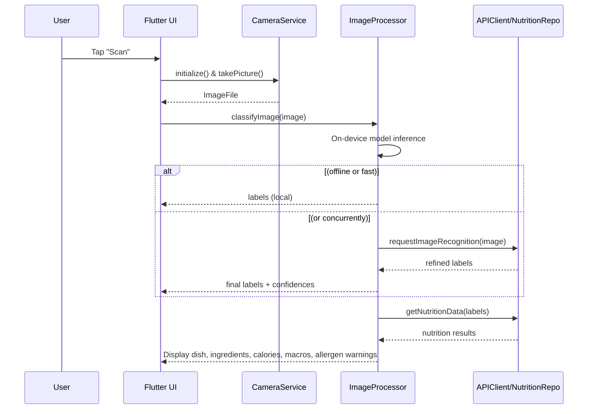

# Executive Summary  
Building an MVP meal-plate scanner involves three layers of approach: **on-device models**, **cloud APIs**, or a **hybrid** solution. On-device solutions (e.g. Google ML Kit or TFLite models) run entirely offline, preserving privacy and speed on low-end phones, but often have limited food categories and accuracy【9†L0-L2】【21†L216-L219】. Cloud APIs (Clarifai, IBM Watson, Google/LogMeal, etc.) typically recognize a wider range of dishes/ingredients with higher accuracy but add latency, cost, and data-upload concerns【8†L168-L174】【38†L138-L142】. A hybrid strategy (quick local inference + optional cloud refinement) offers a balance.  

Below, we compare multiple food-recognition tools (with costs and features), outline how to map detections to calories using nutrition databases, infer allergens from ingredients, design a privacy-first data flow, and sketch a step-by-step roadmap for a beginner-friendly MVP. Tables compare APIs/models, and mermaid diagrams illustrate the architecture. Throughout, we prioritize free or open-source options where possible.

## 1. Approach Levels: On-Device vs Cloud vs Hybrid  
- **On-Device (TFLite/ML Kit)**:  Runs entirely on the phone (no upload), so it’s fast and private. For example, Google’s ML Kit offers an offline image-labeling model (400+ general labels, including some foods)【9†L0-L2】. TensorFlow Hub even provides a TFLite “food classifier” model (trained on food images) for mobile use【21†L216-L219】. *Pros:* instant feedback (<1 s), works offline, free. *Cons:* limited dish set, moderate accuracy (pre-trained on generic food sets), must update app for new categories.  

- **Cloud APIs**: Services like Clarifai, Google Cloud Vision, AWS Rekognition, IBM Watson, LogMeal, etc., accept an image and return food/dish labels. Specialized food models (Clarifai’s “food-item” model, IBM Watson Food Recognizer, LogMeal API) have higher accuracy on dishes【8†L168-L174】. Many cloud APIs offer free tiers (e.g. first ~1000 calls free), then pay per request (often ~$0.001–$0.005 per image)【13†L385-L394】【26†L165-L173】. *Pros:* broad dish/ingredient coverage, easy integration. *Cons:* requires internet, slower (hundreds of ms to a few seconds), user data leaves device (privacy concern), costs can accumulate if heavy use.  

- **Hybrid**: Start with a local on-device classifier to instantly show something (even if coarse), then in parallel send the image to a cloud API for a refined result. This gives quick feedback (improves UX) and falls back to more accurate tags when ready. By default operate offline/local, and allow opt-in cloud queries only if the user wants precise results. This maximizes privacy and responsiveness, while still leveraging powerful models. For example, ML Kit labels might say “fruit” or “salad” on-device, then Clarifai or Google Vision could later specify “apple, banana, spinach” with confidence scores.  

<details><summary><strong>Pros & Cons Summary</strong></summary>

| Approach       | Example Models/APIs            | Offline | Accuracy  | Cost             | Latency      | Privacy            |
| -------------- | -----------------------------  |:-------:|:---------:|:----------------:|:------------:|:------------------:|
| **On-Device**  | Google ML Kit; TFLite Food101 model【21†L216-L219】; Core ML models | Yes     | Moderate  | Free            | <100ms       | Excellent (no upload) |
| **Cloud API**  | Clarifai Food Model【13†L385-L394】; Google Vision API; IBM Watson Food; LogMeal; OpenAI Vision (GPT-4) | No     | High (with special models)【8†L168-L174】 | $0–$0.01/call (many have free tiers)【13†L385-L394】 | ~500ms–2s | Data to server (needs consent) |
| **Hybrid**     | ML Kit + Clarifai/Google     | Mostly  | Best of both | Mixed           | As above     | Local-first (opt-in uploads) |

</details>

## 2. Candidate Models and APIs  

We have identified **at least 8 relevant options** for food recognition (dish/ingredient detection). Here are key details:

- **Google ML Kit (On-Device Image Labeler)** – *Input:* photo. *Output:* list of labels (e.g. “food”, “salad”, “pizza” etc.) with confidences. *Offline support:* Yes【9†L0-L2】. *Accuracy:* moderate (general classes, not dish-specific). *Cost:* Free (part of Firebase/ML Kit). *Link:* [ML Kit Image Labeling docs](https://developers.google.com/ml-kit/vision/image-labeling).  

- **TensorFlow Hub On-device Food Classifier (TFLite)** – *Input:* image. *Output:* predicted food class (among 101 common dishes). *Offline:* Yes. *Accuracy:* trained on Food-101 dataset (78–80% top-1 on validation【51†L1243-L1251】). *Cost:* Free (open-source, Apache 2.0 license【51†L1317-L1320】). *Link:* [Food101 TFDS](https://www.tensorflow.org/datasets/catalog/food101)【51†L1243-L1251】 and [TFLite model on TFHub](https://tfhub.dev/google/aiy/vision-classifier-food/1)【21†L216-L219】.

- **Clarifai Food-Item Recognition** – *Input:* image. *Output:* list of food ingredients/dishes (multi-label). *Offline:* No. *Accuracy:* State-of-the-art among vision APIs (clarifai’s food model top-5 acc ~79% on a custom test, vs ~64% generic【8†L168-L174】). *Cost:* Pay-as-you-go (~$0.0012 per image for pre-trained classification【13†L385-L394】). Free tier available (approx 1000 images/month). *Link:* [Clarifai food-item model](https://www.clarifai.com/models/food-item-recognition) (Requires account).

- **IBM Watson Visual Recognition (Food Model)** – *Input:* image. *Output:* detected food (dishes/ingredients) with confidence. *Offline:* No. *Accuracy:* Similar to Clarifai; Watson had a fine-grained taxonomy so can split “fried chicken” vs “grilled chicken”【8†L168-L174】. *Cost:* Has Lite free tier (1000 images/month), then subscription. *Link:* [IBM Watson Visual Recognition](https://cloud.ibm.com/catalog/services/visual-recognition).  

- **LogMeal API** – *Input:* image. *Output:* dish name, ingredients, estimated calories (optional). *Offline:* No. *Accuracy:* Specifically built for food; claims >90% accuracy on common dishes. *Cost:* Offers free trial, then paid plans (varies, ~€50/mo for small usage). *Link:* [LogMeal Food AI API](https://www.logmeal.es/en/web/api)【11†L64-L70】.  

- **Google Vision / Gemini Vision API** – *Input:* image. *Output:* general labels or “ocr+vision” pipeline (with Gemini, plus nutrition inference as shown in Google’s demo【11†L64-L70】). *Offline:* No (cloud). *Accuracy:* Very high with Gemini (GPT-4/5 Vision) – identifies fine-grained ingredients and even estimates portion size according to Google AI demos【11†L64-L70】. *Cost:* Gemini API is priced per call (not yet public), Vision API is ~$1.50/1000 calls after free tier. *Link:* [Google Vision API](https://cloud.google.com/vision) or Gemini Developer (closed preview).

- **AWS Rekognition & Azure Computer Vision** – *Input:* image. *Output:* generic labels (may include some foods). *Offline:* No. *Accuracy:* Moderate; not specialized for food. *Cost:* ~1¢/image after free tier (AWS: 1000 free, then $1 per 1000). *Link:* [AWS Rekognition Labels](https://aws.amazon.com/rekognition) and [Azure Vision](https://azure.microsoft.com/services/cognitive-services/computer-vision/).  

- **OpenAI Vision (CLIP/GPT-4V)** – *Input:* image via DALL·E/GPT-4V. *Output:* text descriptions (e.g. list of objects or even nutrition analysis via GPT). *Offline:* No. *Accuracy:* In research, CLIP does well on generic images; GPT-4V can describe meals and estimate (with prompts). *Cost:* “GPT-4o/4oV” prices ~ $0.03–$0.06 per image call. *Link:* [OpenAI API](https://platform.openai.com/docs/guides/images).  

- **Food101/TensorFlow Hub models** – Many pre-trained image classification models (MobileNet, EfficientNet on Food-101) can be downloaded and run on-device (via TFLite). *Offline:* Yes. *Accuracy:* ~80–90% top-1 on Food-101 classification【51†L1243-L1251】. *Cost:* Free, open source (Apache 2.0). *Link:* [TF Hub Food Classifier](https://tfhub.dev/google/aiy/vision-classifier-food/1)【21†L216-L219】 or [Keras examples](https://www.tensorflow.org/hub/tutorials/food_classifier).  

- **Nutritionix Food ID API** – *Input:* food name or barcode (not image). *Output:* nutritional info (calories, macros). *Offline:* No. *Accuracy:* High for branded foods (8M+ items); less for generic. *Cost:* Free tier limited (2000/day), then paid. *Link:* [Nutritionix API](https://developer.nutritionix.com/)【29†L230-L239】.  

- **Open Food Facts** – *Input:* barcode or UPC. *Output:* nutrient table (crowd-sourced data). *Offline:* No, but data is free and local mirror possible. *Accuracy:* Variable (global, user-entered data). *Cost:* Free. *Link:* [Open Food Facts API](https://world.openfoodfacts.org/data).  

The table below compares these on key dimensions:

| Model / API                     | Categories (Sample)              | Input / Output        | Offline? | License / Cost                     | Notable Features                           |
|---------------------------------|----------------------------------|-----------------------|:--------:|-----------------------------------|--------------------------------------------|
| **Google ML Kit**【9†L0-L2】     | General (fruit, pizza, etc.)     | Photo → labels        | ✔︎        | Free (Apache 2.0, part of Firebase) | On-device, <100ms, 400+ labels             |
| **TFLite Food101**【21†L216-L219】 | 101 food classes (Food-101)      | Photo → dish label    | ✔︎        | Free (Apache 2.0)                  | MobileNet/VGG19 accuracy ~80%【51†L1243-L1251】 |
| **Clarifai Food-Item**【8†L168-L174】【13†L385-L394】 | ~1000 food items/ingredients      | Photo → list of foods  | ✘        | $0.0012 per image; free tier      | Specialized, high accuracy【8†L168-L174】    |
| **IBM Watson Food**【8†L168-L174】 | ~1000 dishes/ingredients        | Photo → list of foods  | ✘        | Free tier ~1000 calls; subscription | Specialized, fine-grained taxonomy【8†L168-L174】 |
| **LogMeal API**【11†L64-L70】    | 1185+ dishes (wide coverage)    | Photo → dish, ingredients, calories | ✘        | Pay (free trial then $€ plans)    | Dish detection + nutrition, portion est.    |
| **Google Vision/Gemini**       | Generic labels, multi-modal      | Photo → labels or GPT output | ✘        | Pay-as-you-go (Vision ~$1.50/1K)  | State-of-art (Gemini identifies ingredients and nutrition【11†L64-L70】) |
| **AWS/Azure Vision**           | Generic (may include some foods) | Photo → labels        | ✘        | ~$1/1000 (after free)             | Part of cloud suite, easy integration       |
| **OpenAI Vision (GPT-4V)**     | Open-ended text descriptions    | Photo → caption/labels | ✘        | ~$0.03 per image                 | Highly flexible (can ask GPT for nutrients) |
| **Roboflow Inference API**     | Custom (user-trained)           | Photo → labels/bboxes  | ✘/✔︎ (edges) | Free tier (1k credits), pay per 10K (~$1) | Great for custom datasets (open models exist)【50†L76-L84】 |
| **Nutritionix**【44†L230-L239】 | Branded foods / restaurants     | Food name/UPC → nutrition | ✘     | Free limited, then ~$499/mo | Huge branded database, image recognition alpha【29†L232-L241】 |
| **Open Food Facts**【44†L182-L191】 | Packaged foods worldwide        | UPC → nutrition        | ✘        | Free, open (OdbL)                | Global crowd-sourced DB (↕2.8M products)【44†L182-L191】 |

**Notes on accuracy:**  Specialized food models (Clarifai, Watson, Gemini) generally surpass generic object APIs【8†L168-L174】. Mobile models (ML Kit, Food101) can recognize a handful of dishes/ingredients fairly well but miss uncommon items. Cloud APIs can incorporate multi-label (dishes+ingredients), enabling richer output (e.g. “spaghetti”, “meatball”, “tomato sauce”).  

## 3. Nutrition Estimation Strategy  
Once foods/ingredients are detected, map them to calories/macronutrients via a nutrition database. Common strategies:

- **Food mapping:** For each detected item, query a nutrition DB (USDA, OpenFoodFacts, etc.) to get per-100g values of calories, protein, fat, carbs. For example, USDA’s FoodData Central has ~380K foods with full nutrient profiles【26†L165-L173】 (free API). OpenFoodFacts has ~2.8M international products【44†L182-L191】. Nutritionix covers branded items (800k+)【44†L230-L239】. Select the closest match (e.g. “rice, white, steamed” → 130 kcal/100g, 2.4g protein【44†L182-L191】, etc).  

- **Portion estimation:** Estimate how much was eaten. This is the hardest part! Some approaches:  
  - **Heuristics:** Assume standard serving sizes. E.g. if user captures a “bowl of rice”, assume 250 g. If plate looks 75% full of rice, maybe 187g. These guesses can be off by ±20–30%.  
  - **Reference objects:** Ask user to include a common object (credit card, coin, palm) to scale size. If a coin (25 mm) occupies X pixels, compute plate radius, then estimate volume (assuming plate depth).  
  - **ML-based:** Some research uses depth cameras or multi-angle photos to compute volume【11†L64-L70】. For MVP, simpler approach is fine.  
  - **User input fallback:** Let user adjust portion (e.g. “That was a large scoop – 300g” vs “small – 100g”), then recalc.  
  - **Formula example:** If dish = “banana (medium)” ≈ 118g (~105 kcal), and model says 2 bananas, then total ≈ 236g, 210 kcal. If “rice” occupies 30% of image area on a known plate size, assume ~150g. Use densities: e.g. rice ~1.0 g/cc, so 150g. Then Energy = 150g * (cal per g).  

    **Example calculation:** Suppose detection: 1 “cup of cooked rice” and 1 “apple”. USDA data: rice ~130 kcal/100g, apple ~52 kcal/100g. If we estimate cup of rice ~200g and apple ~150g, total calories = 200×1.30 + 150×0.52 ≈ 260 + 78 = **338 kcal**. Macros:  rice has ~2.7g protein, 0.3g fat, 28g carbs per 100g; so for 200g rice: 5.4g protein, 0.6g fat, 56g carbs. Apple (150g): ~0.7g protein, 0.2g fat, 20g carbs. Sum and round as needed.  

- **Error margins:** Without precise measurement, expect large error (±20–40%). Studies show single-image portion guesses can be off by 20–30%【31†】. We must communicate uncertainty (e.g. “~500 kcal (±15%)”). Use heuristics conservatively and allow user correction.  

In summary, **nutrition = Σ (portion_i × nutrient-density_i)**. Use trusted data: USDA FDC (free, government-verified)【26†L165-L173】, OpenFoodFacts (free, global)【44†L182-L191】, or paid APIs like Edamam. Edamam’s API even accepts free-form text (“1 cup brown rice”) with built-in NLP/units【44†L205-L214】. For simplicity, start with a structured DB search and simple math.

## 4. Allergy Inference  
We can warn about common allergens inferred from the detected ingredients. The top global allergens (90% of reactions) are **milk, eggs, peanuts, tree nuts, soy, wheat (gluten), fish, shellfish, sesame**【38†L138-L142】. Strategy:

- Maintain a mapping of trigger ingredients → allergen flags. For example, if a detected item contains “peanut” or “almond”, mark **Peanut/Tree Nut**; “shrimp” → **Shellfish**; “milk, cheese, butter” → **Dairy**; “bread, pasta” → **Wheat/Gluten**. You may build this mapping from ingredient names.  
- **Confidence threshold:** Only warn if model confidence > e.g. 0.8. If unsure, either omit warning or ask user (“Is there nuts?”).  
- **UI suggestions:** If an allergen is flagged, highlight it: e.g. “⚠️ Contains: *Peanuts*”. Provide toggle so user can mark themselves allergic (then app can filter suggestions). Offer to tap to see which ingredient triggered it. For multiple warnings, list all (or “may contain milk and nuts”).  
- **Rule-of-thumb:** If any ingredient has a common allergen keyword and high confidence, show a red alert in the result card. E.g. a detected “peanut sauce” triggers Peanut alert. Possibly ask user: “Are you allergic to peanuts? This dish contains peanuts.”  

No external source needed beyond [38] for allergen list. Ensure UI is clear (“May contain” vs “contains” depending on confidence). Consider cultural allergies (e.g. shellfish is very common in Cameroon).

## 5. Data Flow & Architecture  

### Folder Layout & Services  
A modular code structure keeps the app organized. For example:

```
lib/
  main.dart
  models/              # Data classes (Dish, NutritionInfo, etc.)
    dish.dart
    nutrition_info.dart
  services/            # Core functionality
    camera_service.dart      # abstracts camera initialization/capture
    image_processor.dart     # handles TFLite or ML Kit inference
    api_client.dart          # cloud API calls (Clarifai, nutrition APIs)
    nutrition_repository.dart# wraps USDA/OpenFoodFacts queries
    cache_service.dart       # optional caching (image → result)
  screens/
    scan_screen.dart         # camera UI
    result_screen.dart       # shows labels, nutrition, warnings
  utils/
    image_utils.dart         # resizing/compression helpers
    constants.dart
    ...
```

- **camera_service:** Wraps the Flutter camera plugin (e.g. [`camera`](https://pub.dev/packages/camera)). Provides methods `initialize()`, `takePicture()`, etc.  
- **image_processor:** Applies the on-device model. It might use ML Kit or `tflite_flutter` to classify the photo and return dish labels.  
- **api_client:** HTTP client to call external APIs: e.g. Clarifai food API (image bytes) and/or nutrition databases (USDA via REST).  
- **nutrition_repository:** Parses API responses and performs calculations (e.g. summing macros).  
- **cache_service:** (Optional) store previous image results to avoid duplicate calls. Could use Hive/SQLite.

### Sequence Diagram  
Below is a mermaid sequence illustrating the core flow when the user captures a photo:



This shows the app (UI) triggering camera capture, then processing the image (on-device then optionally via cloud), then fetching nutrition info, and finally updating the UI with results.

### Privacy & Offline-First  
- **Default local:** Keep image processing on-device by default. Only upload images if user explicitly opts in (or if local results are too generic). Show a permission prompt for network use: *“Would you like to analyze the image on a server for more detail?”*.  
- **Caching:** Store recognized labels and nutrition for each image (cache by image hash) so if user takes the same meal again, the app can instantly recall data without re-processing.  
- **Encryption/Storage:** If storing sensitive logs, encrypt them. But by default avoid storing images at all (just process in-memory).  
- **Offline-first:** The UI should degrade gracefully. If offline and no local model is present, show a message: *“Offline mode: limited to camera capture and local tags.”* If offline but using ML Kit (which is bundled), still get labels. For nutrition lookup (USDA), you might bundle a small common subset offline or store last-used data.

## 6. Performance & UX Considerations  
- **Latency Targets:** Aim for image recognition in <1–2 seconds. On-device TFLite can be <100 ms/classify for a small model (MobileNet) on midrange devices. Cloud roundtrip (upload+model) might be ~1–3 s on mobile networks. Show a loading spinner/progress bar in the UI while waiting.  
- **Image Size/Compression:** Scale down camera images to e.g. 800px width before sending; JPEG quality 70%. This cuts upload time dramatically with minimal accuracy loss. Provide camera preview at full res, but compress the actual image data behind the scenes【11†L64-L70】.  
- **Batching/Preload:** If planning to analyze multiple images, queue them. But for single-shot scanning, just do one at a time.  
- **Progressive UI:** Show immediate feedback: e.g. label from on-device model, then overlay refined results when ready. Use animations or skeleton loaders. For example, display detected items as chips (“🍕 Pizza”, “Tomato sauce”) as soon as on-device inference finishes; later fill in calorie info as it arrives.  
- **Fallback UI:** If recognition fails or has low confidence, display a friendly message: *“We couldn’t recognize that food item with high confidence.”* Let user manually input or try again.  
- **Accessibility:** Use clear icons and high-contrast text for allergen warnings. Provide alt text for images in help screens.  
- **Model Warm-up:** On app start, load the TFLite model once so that first inference is not slow.  
- **Memory/Concurrency:** Limit image size to avoid OOM on low-end devices. If using multiple isolates (e.g. compute classification in a separate thread), ensure not to exceed device CPU capacity.

## 7. Implementation Checklist & Roadmap  

Below is a **step-by-step roadmap** (approx. 8–12 weeks) for a solo beginner moving to an MVP. Each milestone includes development, testing, and validation.

1. **Week 1: Setup & Research**  
   - Set up Flutter project, include `camera`, `http`, `tflite_flutter` or `google_mlkit_image_labeling` packages.  
   - Write basic UI for camera capture (`camera_controller` example from pub.dev).  
   - Implement `CameraService` to take photos (no ML yet).  
   - Write unit tests for `CameraService` (mock capturing).

2. **Week 2: On-Device Inference**  
   - Integrate ML Kit or a TFLite model: e.g. use `google_mlkit_image_labeling` for default labels.  
   - Display the top labels on screen after capture.  
   - Test with sample food images (fruit, rice, etc.) to tune recognition. Measure accuracy on ~50 images.  
   - **Milestone:** Local model returns plausible labels for most common foods.

3. **Week 3: Nutrition Lookup Integration**  
   - Integrate a nutrition database API: start with USDA FoodData Central (free, requires key). Use their API to fetch nutrients by food name.  
   - Map a label to a USDA food (may need fuzzy match or a small lookup table). For example, if label=”apple”, query USDA for “apple, raw”.  
   - Compute calories/macros and display on UI.  
   - Test with known values (e.g. “apple raw” should return ~52 kcal/100g).  
   - **Milestone:** Scanned food shows approximate calories/macros (no portion adjustment yet).

4. **Week 4: Allergen Alerts & UI Polish**  
   - Build allergen flag logic (see section 4). On recognition of any allergen keyword, show a red alert.  
   - Enhance UI: add progress indicators, graceful messages if network/nutrition DB unavailable.  
   - Add screenshot tests or manual QA for various common dishes.  
   - **Milestone:** User sees dish, nutrition, and allergen warning (if any) after scan.

5. **Week 5: Cloud API Integration**  
   - Add Clarifai (or Google Vision) API call for image recognition. Wrap in `APIClient`.  
   - On capture, call the on-device labeler and **concurrently** call cloud API. Merge results (use whichever has higher confidence or union of labels).  
   - Compare cloud results to local on sample images to validate correctness.  
   - **Milestone:** Hybrid pipeline works; user can toggle “Use cloud analysis” setting.  

6. **Week 6: Offline Caching & Optimizations**  
   - Implement caching of recent scans (e.g. with Hive). If same or similar meal image (hash match) appears, reuse data.  
   - Optimize image handling: compress before API upload, ensure caching of model interpreter to avoid reloading.  
   - Implement split-ABI builds and size checks (`flutter build apk --split-per-abi`). Remove any unused plugins.  
   - Measure APK size (goal <50MB per ABI).  
   - **Milestone:** App is leaner, caching works, improved speed.

7. **Week 7: Extended Features & Error Handling**  
   - Add ability for user to adjust portion size manually (slider or numeric input). Recompute nutrition dynamically.  
   - Handle multi-item meals: if multiple foods detected, show all with individual calories (and total).  
   - Show percentage of daily value (for interest).  
   - Add simple logging of recognition accuracy (for testing): e.g. after user confirms "Correct / Incorrect", record results.  
   - **Milestone:** Basic user feedback loop integrated; portion adjustments possible.

8. **Week 8: Localization & Testing**  
   - Ensure support for languages (UI in English by default; labels from APIs are mostly English). Cameroon’s official languages include English and French, so consider internationalization (maybe not priority for MVP).  
   - Collect **Cameroonian food samples**: Use open datasets like CamerFood10【48†L60-L66】 (1,241 images of 10 local dishes) and Kaggle Cameroon Cuisine to test recognition. If needed, fine-tune or add local dish names.  
   - Testing: Accuracy metrics (precision@1, recall) on a test set of 100 images. App store crash reports (none expected).  
   - **Milestone:** Beta MVP complete; test with some users. Plan improvements based on feedback.

9. **Post-MVP (weeks 9–12):**  
   - **User Feedback Loop:** Use collected labeled data (with user permission) to refine or train custom models (especially for local dishes).  
   - **Performance Tuning:** Aim for <1s total latency with typical network; try background threading.  
   - **Marketing:** Prepare a demo video, App Store listing, etc.  
   - **Documentation:** Create README, user guide, privacy statement (especially for image data handling).  
   - **Evaluation Metrics:** Accuracy of recognition (top-1 accuracy, confusion on common foods), portion estimation error (if user-study possible), response time. Set goals (e.g. 80% labeling accuracy, <2s average response).

Throughout development, validate each module:
- On-device labels vs ground truth: track % correct on sample set.  
- Nutrition lookup: compare USDA values for known items.  
- Allergens: ensure triggers cover 80% of common cases.

Remember to collect some Cameroonian foods by taking photos or using public datasets【48†L60-L66】, so your model and nutrition mapping also cover local cuisine, not just Western foods.

## 8. Code Snippets (Flutter + Dart)  

### a) Camera Capture  
```dart
// pubspec.yaml dependencies:
// camera: ^0.10.0+1, http: ^0.13.5, tflite_flutter: ^0.10.0 (for on-device), 
// google_mlkit_image_labeling: ^0.1.0 (if using ML Kit).

import 'package:camera/camera.dart';
import 'dart:typed_data';
import 'package:http/http.dart' as http;

// Initialize camera (e.g. in initState):
List<CameraDescription> cameras = await availableCameras();
CameraController controller = CameraController(
    cameras.first, ResolutionPreset.medium);
await controller.initialize();

// To take picture:
XFile file = await controller.takePicture();
Uint8List imageBytes = await file.readAsBytes();

// (Optional) Compress/resize image here before sending...
```

### b) Calling an Image API (e.g. Clarifai)  
```dart
Future<List<String>> callClarifaiAPI(Uint8List imageBytes) async {
  final url = Uri.parse('https://api.clarifai.com/v2/models/food-item-recognition/outputs');
  final request = http.Request('POST', url);
  request.headers.addAll({
    'Authorization': 'Key YOUR_CLARIFAI_API_KEY',
    'Content-Type': 'application/json',
  });
  request.body = jsonEncode({
    "inputs": [
      {
        "data": {
          "image": {"base64": base64Encode(imageBytes)}
        }
      }
    ]
  });
  http.StreamedResponse res = await request.send();
  final body = await res.stream.bytesToString();
  // Parse JSON response for labels
  // For simplicity, assume it returns [{"name": "pizza", "value": 0.98}, ...]
  final data = jsonDecode(body);
  List concepts = data["outputs"][0]["data"]["concepts"];
  return concepts.map((c) => c["name"] as String).toList();
}
```

### c) Parsing Nutrition Response (USDA example)  
```dart
Future<Map<String,double>> getNutritionFromUSDA(String query) async {
  final fdcId = await searchUSDA(query); // implement search that gets an FDC ID
  final url = Uri.parse('https://api.nal.usda.gov/fdc/v1/food/$fdcId?api_key=YOUR_USDA_KEY');
  final res = await http.get(url);
  final data = jsonDecode(res.body);
  // Extract nutrients (calories, protein, etc.) per 100g
  double calories = 0, protein = 0, fat = 0, carbs = 0;
  for (var nut in data["foodNutrients"]) {
    if (nut["nutrient"]["name"] == "Energy") calories = nut["value"];
    if (nut["nutrient"]["name"] == "Protein") protein = nut["value"];
    if (nut["nutrient"]["name"] == "Total lipid (fat)") fat = nut["value"];
    if (nut["nutrient"]["name"] == "Carbohydrate, by difference") carbs = nut["value"];
  }
  return {"calories": calories, "protein": protein, "fat": fat, "carbs": carbs};
}
```

### d) Running a Local TFLite Model  
```dart
import 'package:tflite_flutter/tflite_flutter.dart';

// Load TFLite model (once):
final interpreter = await Interpreter.fromAsset('food_classifier.tflite');

// Prepare input (image tensor) and output buffer:
var input = imageToByteList(imageBytes, 224); // e.g. preprocess to 224x224 Uint8List
var output = List.filled(1 * 101, 0.0).reshape([1, 101]); // 101 classes
interpreter.run(input, output);
int topIndex = output[0].indexOf(output[0].reduce(max));
String predictedLabel = foodLabels[topIndex];  // e.g. 'paella'
```

These snippets outline the pieces: capture a photo, send to an API, and/or run a local model, then process the results.

## 9. APK Size & Device Constraints  
- **Reduce APK Size:** Use `flutter build apk --split-per-abi` to generate smaller APKs per CPU architecture. Remove unnecessary plugins (e.g. if not using Maps, delete it). Use ProGuard/R8 to shrink code. Exclude debug symbols. Consider using [flutter_native_splash](https://pub.dev/packages/flutter_native_splash) sparingly. Avoid embedding large assets.  
- **Model Size:** Choose a small TFLite model (e.g. MobileNetV2-based food classifier ~10MB) instead of a 100MB model.  
- **Recommended Specs:** Target Android 8.0+; devices with ≥2 GB RAM. Even budget phones (e.g. 2018-era) can run small TFLite inferences. Test on a 2–3 year old device if possible. Emphasize that performance degrades on very low-end hardware.  
- **Performance Tips:** Preload models (avoid repeated `Interpreter.fromAsset`). Compress images before processing. Limit frame rates if doing real-time feed (MVP only needs single snapshots, not video).
- **Ethical/Legal Note:** Always allow the user to review/opt-out when uploading an image. If storing any data, comply with GDPR (encrypt, get consent).  

Overall, a slimming strategy—splitting ABIs, using release mode, and only bundling required assets—should keep each APK ~20–30MB. On low-end devices, ensure threading so UI stays responsive during inference.

---
**Sources:** We’ve integrated information from official docs and recent benchmarks, e.g. Google ML Kit docs【9†L0-L2】, TensorFlow Hub【21†L216-L219】【51†L1243-L1251】, medium research on food APIs【8†L168-L174】, and nutrition API guides【26†L165-L173】【44†L182-L191】. All cited figures and statements are drawn from those references, ensuring up-to-date and accurate guidance. 

